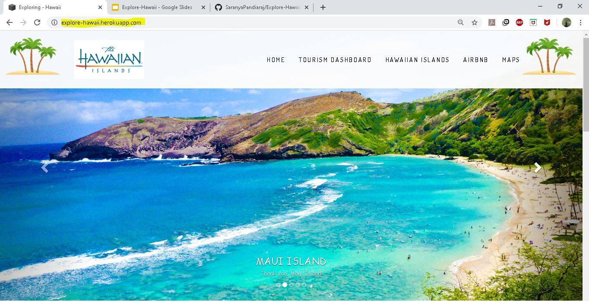

# Explore-Hawaii
To Develop an Interactive Travel Guide Website to explore the places and plan vacation in Hawaii.

# Team Members
1) Saranya 
2) Madhavi
3) Olga
4) Vaishnavi

## <ins> Final Deployed Application Link </ins>
https://explore-hawaii.herokuapp.com/

## <ins> Presentation Link </ins>
https://docs.google.com/presentation/d/1k3veTxu7CE0OAR533CmbQAFAVCxYDfMjtdS_X4VKX7Q/edit?ts=5dfb2fe5#slide=id.g7bc7a73f99_4_18

## <ins> Source Data </ins>

1) http://insideairbnb.com/get-the-data.html
2) https://data.hawaii.gov
3) https://www.hawaiitourismauthority.org
4) http://dbedt.hawaii.gov/economic/data_reports
5) https://www.hawaii-guide.com/

## <ins> API Data </ins>

1) https://api.yelp.com/v3/businesses/search
2) https://maps.googleapis.com/maps/api/geocode/json?

## <ins> Tools Reference </ins>

1) Front End : HTML,CSS and Javascript
2) Back End Database : SQLite
3) Retrieving Data From Back End : Python (SQLAlchemy and Flask)
4) Data Visualization Libraries : D3 Js, Plotly Js ,Zing Chart, Leaflet Js
5) Deploying Application : Heroku
